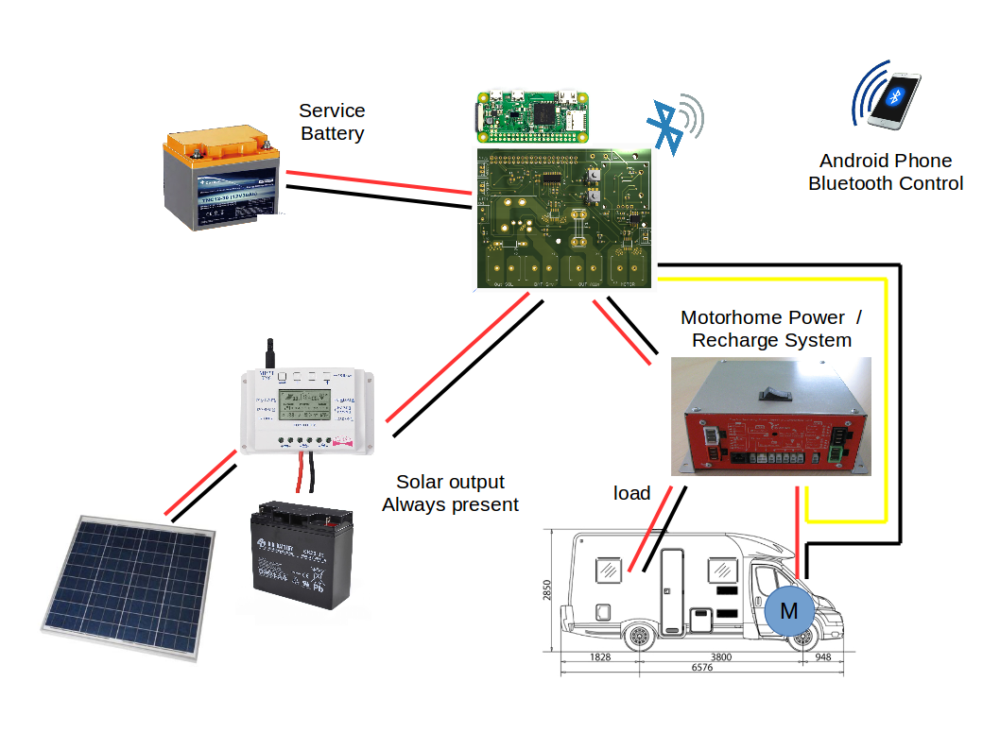

# caravanshield
Caravan/Motorhome battery manager shield for Raspberry Pi W Zero

Schematics and PCB board are made in Eagle 8.6.3. See board/ folder.
In the folder yoy can found schematic in PDF version, 3D-render for the PCB and Gebers files.

The firmware and software for Android is made with Qt5.9.
In the folder raspberry/ you can found the firmware for Rapsberry Pi.
In the folder android/ you can found the source for the Android APK.
In the folder remotelcd/ you can found the OledLCD emulation for developing the rapberry firmware on Linux PC (x86_64).

